# Arquitetura do Sistema — PJFin

## Visão Geral

```
+-----------------+         +-----------------+         +-----------------+
|                 |  HTTPS  |                 |   SQL   |                 |
|   React + MUI   | ──────► |    NestJS API   | ──────► |   PostgreSQL    |
|   (Vercel)      |         |   (Render)      |         |   (Render)      |
|                 | ◄────── |                 | ◄────── |                 |
+-----------------+  JSON   +-----------------+  Prisma +-----------------+
```

---

## Frontend

### Stack
- **React 18** + **TypeScript**
- **Vite** — build tool
- **MUI (Material UI)** — component library
- **React Router v6** — roteamento
- **React Query** — server state management
- **Axios** — cliente HTTP
- **Zustand** — estado global (auth, tema)
- **React Hook Form + Zod** — formulários e validação

### Estrutura de Pastas

```
src/
├── assets/
├── components/             # Componentes reutilizáveis
│   ├── layout/             # AppLayout, Sidebar, Topbar
│   └── ui/                 # Button, Modal, Table, Form, Badge, etc.
├── features/               # Módulos organizados por domínio
│   ├── auth/               # Login, Cadastro, RecuperarSenha
│   ├── dashboard/          # DashboardPage, KPICards, Charts
│   ├── transactions/       # TransactionList, TransactionForm, TransactionFilters
│   ├── bills/              # BillsPage, BillCard, BillStatusBadge
│   ├── cashflow/           # CashflowPage, CashflowTable, CashflowChart
│   └── categories/         # CategoryList, CategoryForm
├── hooks/                  # Custom hooks (useAuth, useCompany, etc.)
├── lib/                    # Configurações (axios, queryClient, zod schemas)
├── pages/                  # Páginas roteadas (re-exportam as features)
├── routes/                 # Definição e proteção de rotas
├── store/                  # Zustand stores (auth, company)
├── types/                  # TypeScript types e interfaces globais
└── utils/                  # Formatadores, helpers, constantes
```

---

### Arquitetura de Rotas

As rotas são divididas em dois grupos: **públicas** (acessíveis sem autenticação) e **privadas** (protegidas por `PrivateRoute`, que redireciona para `/login` caso o usuário não esteja autenticado).

```
/                        → redireciona para /dashboard (autenticado) ou /login
│
├── /login               → LoginPage          (pública)
├── /cadastro            → RegisterPage       (pública)
├── /recuperar-senha     → ForgotPasswordPage (pública)
│
└── [PrivateRoute]       → AppLayout (Sidebar + Topbar)
    ├── /dashboard               → DashboardPage
    ├── /transacoes              → TransactionsPage
    ├── /transacoes/nova         → TransactionFormPage
    ├── /transacoes/:id          → TransactionFormPage (edição)
    ├── /contas                  → BillsPage
    ├── /fluxo-de-caixa          → CashflowPage
    ├── /categorias              → CategoriesPage
    ├── /empresa                 → CompanyProfilePage (editar empresa)
    └── /perfil                  → ProfilePage
```

---

### Diagrama de Componentes

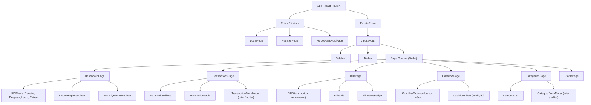

---

### Fluxo de Autenticação (Frontend)

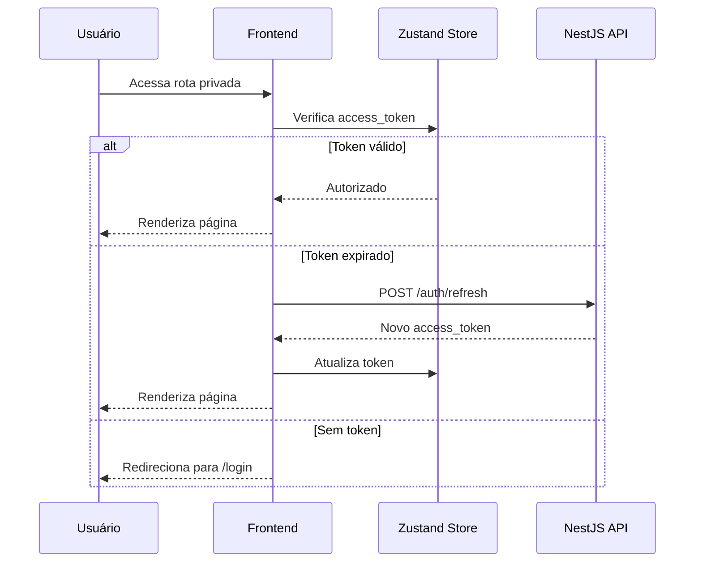

---

## Backend

### Stack

| Pacote | Função |
|---|---|
| NestJS + TypeScript | Framework principal |
| Prisma ORM | Acesso e migrations do banco |
| PostgreSQL | Banco de dados relacional |
| Passport.js + passport-jwt | Estratégias de autenticação |
| @nestjs/jwt | Geração e validação de tokens JWT |
| class-validator + class-transformer | Validação e transformação de DTOs |
| @nestjs/swagger | Documentação automática da API |
| bcrypt | Hash de senhas |

---

### Estrutura de Pastas

```
src/
├── auth/
│   ├── auth.module.ts
│   ├── auth.controller.ts
│   ├── auth.service.ts
│   ├── strategies/
│   │   ├── jwt.strategy.ts
│   │   └── jwt-refresh.strategy.ts
│   └── dto/
│       ├── login.dto.ts
│       ├── register.dto.ts   # name, last_name, company_name, cnpj, email, password
│       └── forgot-password.dto.ts
│
├── users/
│   ├── users.module.ts
│   ├── users.controller.ts
│   ├── users.service.ts
│   └── dto/
│       ├── create-user.dto.ts
│       └── update-user.dto.ts
│
├── categories/
│   ├── categories.module.ts
│   ├── categories.controller.ts
│   ├── categories.service.ts
│   └── dto/
│       ├── create-category.dto.ts
│       └── update-category.dto.ts
│
├── transactions/
│   ├── transactions.module.ts
│   ├── transactions.controller.ts
│   ├── transactions.service.ts
│   └── dto/
│       ├── create-transaction.dto.ts
│       ├── update-transaction.dto.ts
│       └── filter-transaction.dto.ts
│
├── cashflow/
│   ├── cashflow.module.ts
│   ├── cashflow.controller.ts
│   └── cashflow.service.ts
│
├── common/
│   ├── guards/
│   │   └── jwt-auth.guard.ts
│   ├── decorators/
│   │   └── current-user.decorator.ts
│   └── filters/
│       └── http-exception.filter.ts
│
├── prisma/
│   ├── prisma.module.ts
│   └── prisma.service.ts
│
└── main.ts
```

---

### Responsabilidades de Cada Módulo

#### AuthModule
Gerencia autenticação completa com JWT e Refresh Token.

- `POST /auth/register` — cria usuário e empresa (campos: nome, sobrenome, nome da empresa, CNPJ, e-mail, senha)
- `POST /auth/login` — retorna `access_token` + `refresh_token`
- `POST /auth/refresh` — renova o `access_token`
- `POST /auth/logout` — invalida o `refresh_token`

Dependências: `UsersModule`, `PrismaModule`, `JwtModule`

---

#### UsersModule
Gerencia o perfil do usuário autenticado.

- `GET /users/me` — retorna dados do usuário logado
- `PATCH /users/me` — atualiza nome e senha

Dependências: `PrismaModule`

---

#### CategoriesModule
Gerencia categorias financeiras por empresa.

- `GET /categories` — lista categorias da empresa ativa
- `POST /categories` — cria categoria
- `PATCH /categories/:id` — atualiza categoria
- `DELETE /categories/:id` — remove categoria

Dependências: `PrismaModule`

---

#### TransactionsModule
Módulo central. Gerencia entradas, saídas e contas a pagar/receber.

- `GET /transactions` — lista com filtros (tipo, status, período, categoria)
- `POST /transactions` — cria transação
- `GET /transactions/:id` — busca por ID
- `PATCH /transactions/:id` — atualiza transação
- `DELETE /transactions/:id` — remove transação

Dependências: `PrismaModule`, `CategoriesModule`

---

#### CashflowModule
Calcula e retorna o fluxo de caixa mensal agregando transações.

- `GET /cashflow` — retorna saldo inicial, entradas, saídas e saldo final por mês

Dependências: `PrismaModule`, `TransactionsModule`

---

#### PrismaModule
Módulo global que expõe o `PrismaService` para todos os outros módulos.

---

### Diagrama de Módulos NestJS

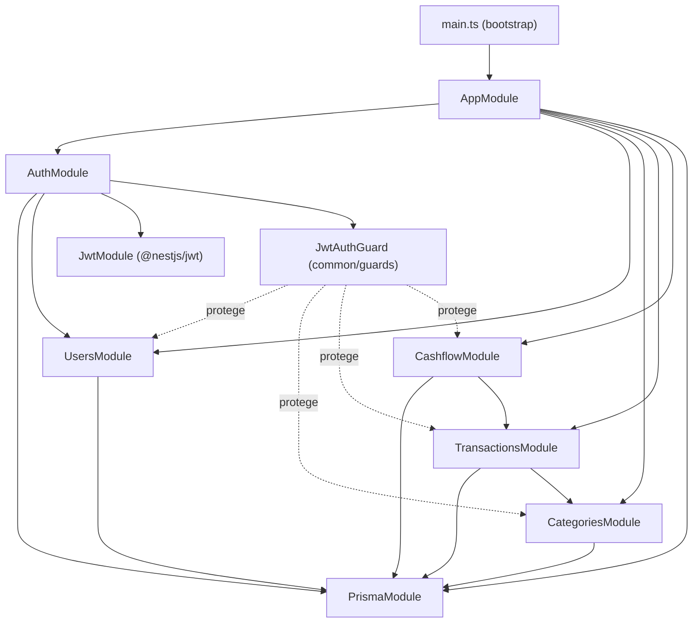

---

### Fluxo de uma Requisição Autenticada

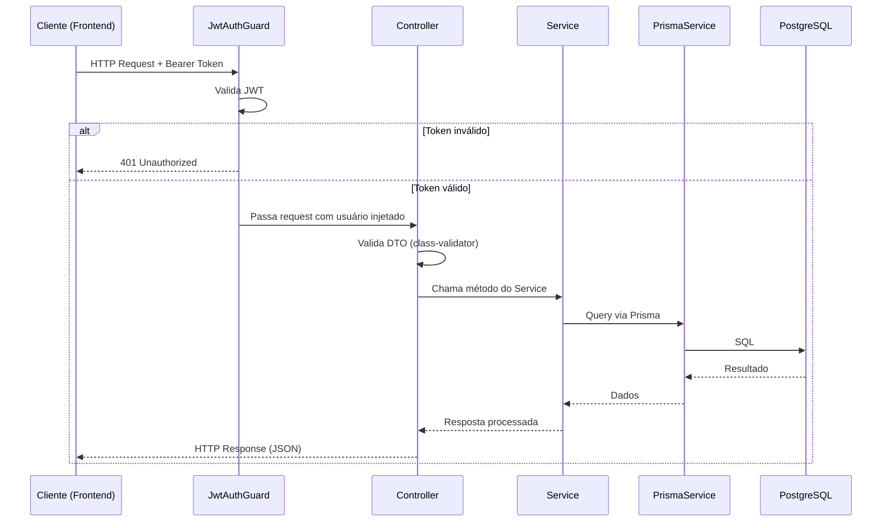

---

## Banco de Dados

### Entidades e Atributos

---

#### User
Representa o usuário do sistema. Cada usuário possui exatamente uma empresa.

| Coluna | Tipo | Descrição |
|---|---|---|
| id | UUID | Chave primária |
| first_name | VARCHAR | Nome |
| last_name | VARCHAR | Sobrenome |
| email | VARCHAR | E-mail único |
| password_hash | VARCHAR | Senha criptografada |
| company_id | UUID | FK para Company (1:1) |
| created_at | TIMESTAMP | Data de criação |
| updated_at | TIMESTAMP | Data de atualização |

---

#### Company
Representa a empresa do usuário, criada no momento do cadastro.

| Coluna | Tipo | Descrição |
|---|---|---|
| id | UUID | Chave primária |
| name | VARCHAR | Nome da empresa |
| cnpj | VARCHAR | CNPJ único |
| created_at | TIMESTAMP | Data de criação |
| updated_at | TIMESTAMP | Data de atualização |

---

#### Category
Categorias financeiras criadas por empresa para classificar transações.

| Coluna | Tipo | Descrição |
|---|---|---|
| id | UUID | Chave primária |
| company_id | UUID | FK para Company |
| name | VARCHAR | Nome da categoria |
| type | ENUM | income, expense |
| created_at | TIMESTAMP | Data de criação |
| updated_at | TIMESTAMP | Data de atualização |

---

#### Transaction
Entidade central do sistema. Representa entradas, saídas, contas a pagar e contas a receber — tudo é uma transação com atributos que definem seu comportamento.

| Coluna | Tipo | Descrição |
|---|---|---|
| id | UUID | Chave primária |
| company_id | UUID | FK para Company |
| category_id | UUID | FK para Category |
| type | ENUM | income, expense |
| amount | DECIMAL(10,2) | Valor da transação |
| date | DATE | Data de competência |
| due_date | DATE | Data de vencimento (nullable) |
| status | ENUM | paid, pending, overdue |
| payment_method | ENUM | pix, boleto, credit_card, debit_card, cash, transfer |
| contact_name | VARCHAR | Nome do cliente ou fornecedor (texto livre, nullable) |
| description | TEXT | Observação livre (nullable) |
| created_at | TIMESTAMP | Data de criação |
| updated_at | TIMESTAMP | Data de atualização |

---

### Relações entre Entidades

```
User         ────── Company      (1:1)
Company      ──────< Category    (1:N)
Company      ──────< Transaction (1:N)
Category     ──────< Transaction (1:N)
```

---

### Diagrama ER

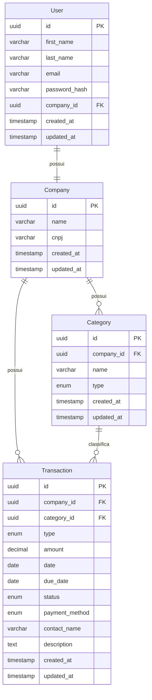

---

## Autenticação

1. Usuário faz login — backend valida credenciais
2. Backend retorna `access_token` (15min) + `refresh_token` (7 dias)
3. Frontend armazena tokens no `localStorage`
4. A cada request, `access_token` é enviado no header `Authorization: Bearer`
5. Quando expirado, frontend usa `refresh_token` para obter novo par de tokens

---

## Deploy

| Serviço | Plataforma | Observação |
|---|---|---|
| Frontend | Vercel | Deploy automático via GitHub |
| Backend | Render | Docker container |
| Banco de Dados | Render | PostgreSQL gerenciado |

---

## Fluxos Principais do Sistema

---

### 1. Cadastro e Onboarding

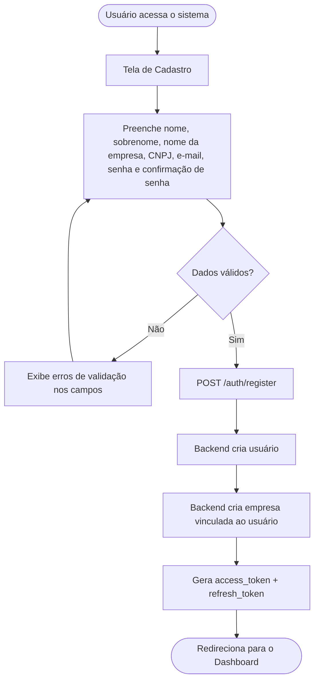

---

### 2. Autenticação — Login e Refresh

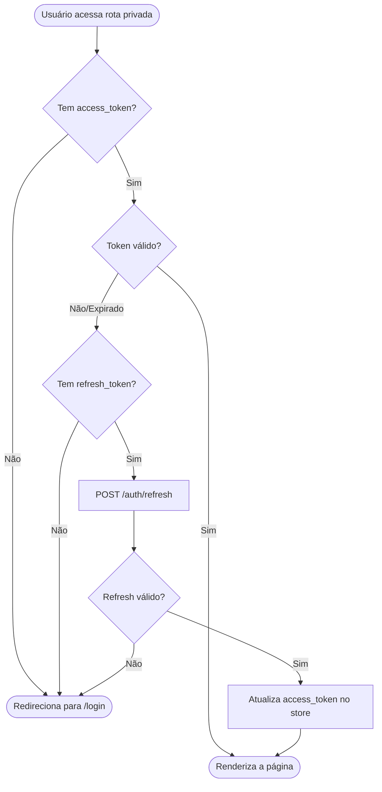

---

### 3. Registro de Transação

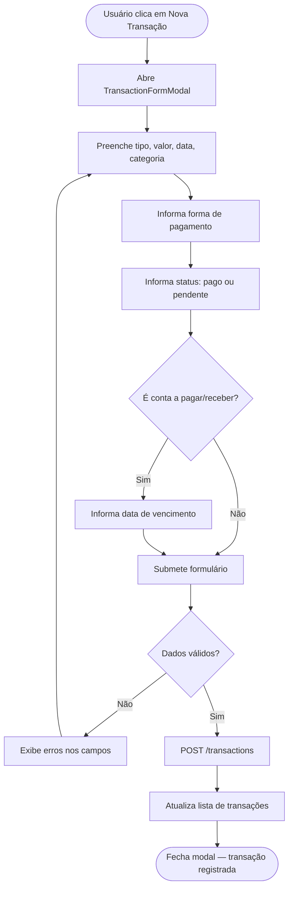

---

### 4. Visualização do Dashboard

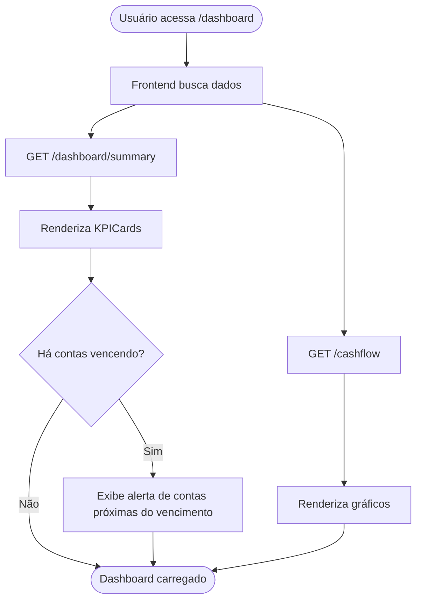

---

### 5. Gestão de Contas a Pagar e Receber

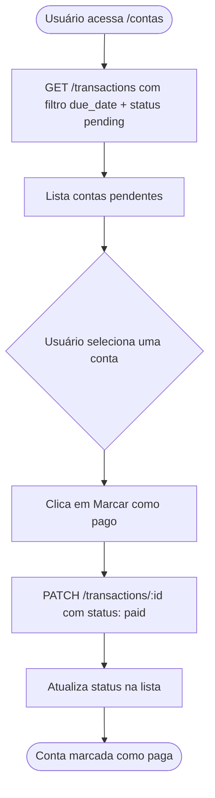

---

### 6. Fluxo de Caixa Mensal

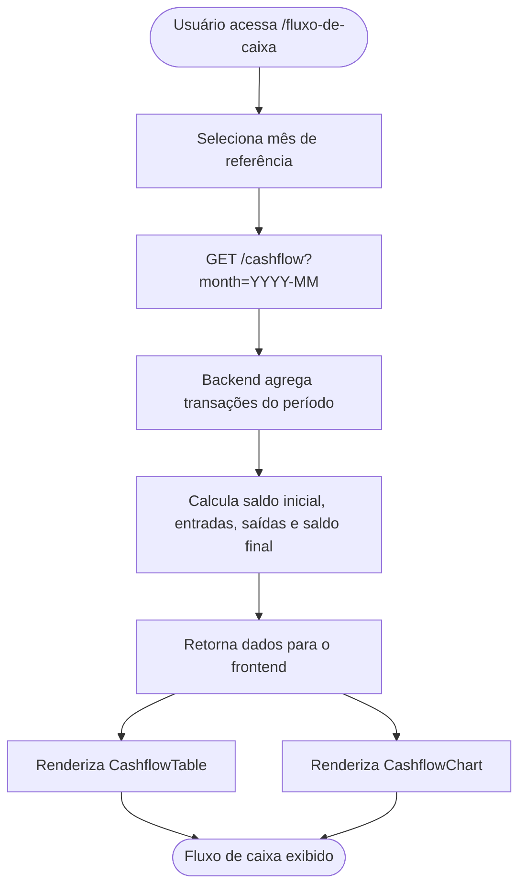
